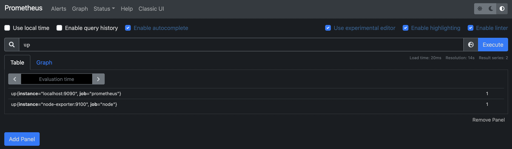
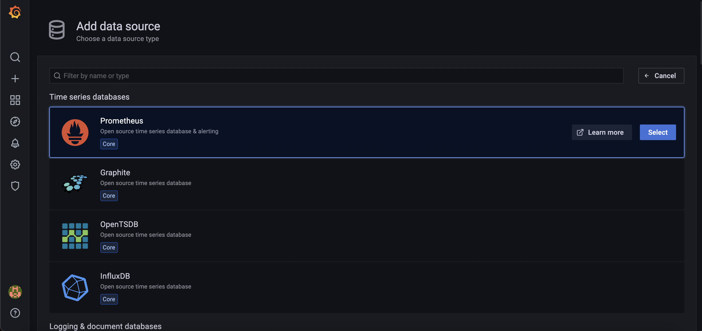
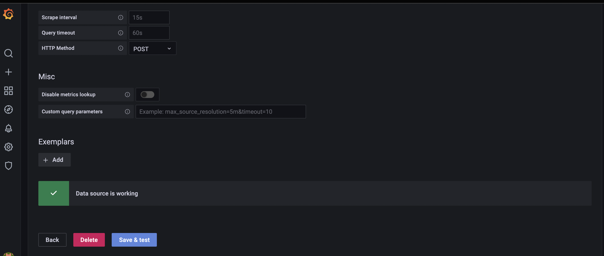
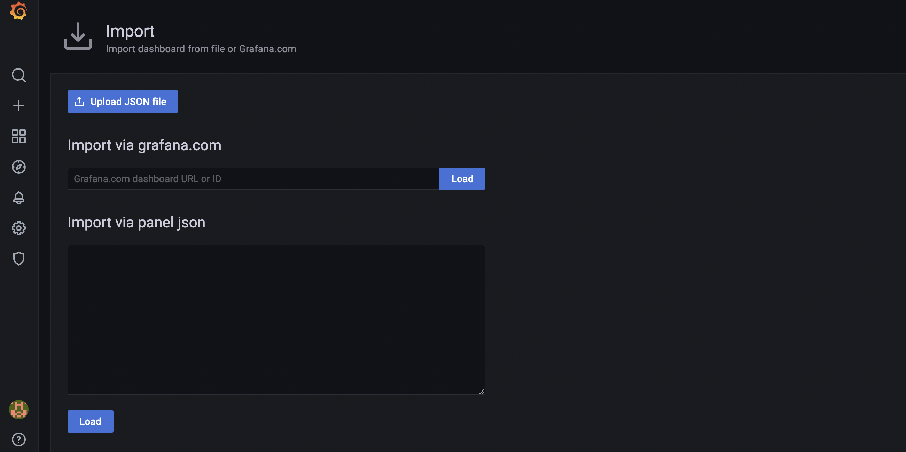
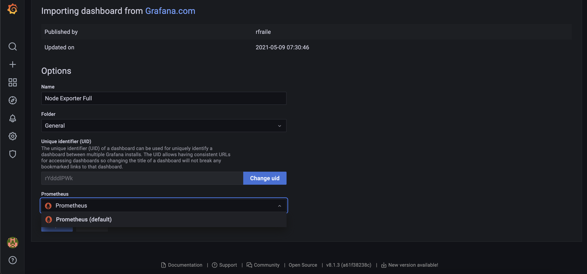
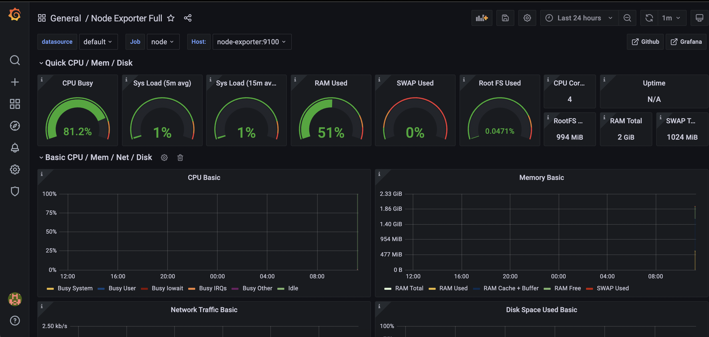

## Node-Exporter + Prometheus + Grafana 연동
---

본 가이드는 docker-compose환경에서 node-exporter, Prometheus, Grafana를 추가하여
모니터링 환경을 구축하는 것을 목표로 한다.

## 1. Node-Exporter

- node-exporter란 UNIX 계열 커널을 가진 하드웨어와 OS릭 등 "시스템 메트릭"을 수집하는 Exporter이다. 
- Prometheus 재단이 공식적으로 지원하고 있는 Exporter 중 하나이며 Prometheus로 모니터링 시스템을 구축 시 시스템 메트릭 수집을 위해 가장 우선적으로 고려되는 Exporter이기도 하다.

## 2. Prometheus

- Prometheus는 이벤트 모니터링 및 Alert에 사용되는 오픈소스 소프트웨어이다. 유연한 쿼리 및 실시간 경고와 함께 HTTP 모델을 사용하여 구축 된 시계열 데이터베이스에 실시간 메트릭을 기록한다.

- 데이터 수집하고, 데이터를 가공하고, 데이터를 분석할 수 있는 쿼리를 제공하는 오픈소스 소프트웨어.

## 3. Grafana

- Grafana는 Prometheus에서 정렬한 데이터를 브라우저에 시각화주는 역할을 한다.

 

Step 1. docker-compose.yml 작성
---
<pre><code>version: '3.8'
  
networks:
  monitoring:
    driver: bridge

volumes:
  prometheus_data: {}

services:
  node-exporter:
    image: prom/node-exporter:latest
    container_name: node-exporter
    restart: unless-stopped
    volumes:
      - /proc:/host/proc:ro
      - /sys:/host/sys:ro
      - /:/rootfs:ro
    command:
      - '--path.procfs=/host/proc'
      - '--path.rootfs=/rootfs'
      - '--path.sysfs=/host/sys'
      - '--collector.filesystem.mount-points-exclude=^/(sys|proc|dev|host|etc)($$|/)'
    ports:
      - 9100:9100
    networks:
      - monitoring

  prometheus:
    image: prom/prometheus:latest
    container_name: prometheus
    restart: unless-stopped
    volumes:
      - ./prometheus.yml:/etc/prometheus/prometheus.yml
      - prometheus_data:/prometheus
    command:
      - '--config.file=/etc/prometheus/prometheus.yml'
      - '--storage.tsdb.path=/prometheus'
    ports:
      - 9090:9090
    networks:
      - monitoring
</code></pre>
docker-compose.yml에 node-exporter 이미지를 추가한다. 
<pre><code>volumes:
    - /proc:/host/proc:ro
    - /sys:/host/sys:ro
    - /:/rootfs:ro</code></pre>
node-exporter, prometheus, grafana를 연결할 브릿지 네트워크로 monitoring을 정의한다.
volumes에서 node-exporter에서 필요한 경로를 읽기전용(ro)으로 설정한다.
<pre><code>command:
    - '--path.procfs=/host/proc'
    - '--path.rootfs=/rootfs'
    - '--path.sysfs=/host/sys'
    - '--collector.filesystem.mount-points-exclude=^/(sys|proc|dev|host|etc)($$|/)'</code></pre>
node-exporter에서 사용할 경로를 잡아준다. 
collector.filesystem.mount-points-exclude=^/(sys|proc|dev|host|etc)는 자세히는 모르겠으나 권장사항인듯하다.

마찬가지로, prometheus 이미지도 추가한다. 
<pre><code>volumes:
  prometheus_data: {}</code></pre>
로컬 디렉토리에 데이터를 저장하기 위해서 volumn을 설정한다. 
<pre><code>volumes:
      - ./prometheus.yml:/etc/prometheus/prometheus.yml
      - prometheus_data:/prometheus
command:
    - '--config.file=/etc/prometheus/prometheus.yml'
    - '--storage.tsdb.path=/prometheus'</code></pre>
다음 단계에서 작성할 prometheus.yml파일을 config파일로 설정해두고, 데이터 저장 폴더를 설정해준다.

Step 2. prometheus.yml 작성
---
<pre><code>global:
  scrape_interval: 15s

scrape_configs:
  - job_name: "prometheus"
    scrape_interval: 5s
    static_configs:
    - targets: ["localhost:9090"]

  - job_name: "node"
    static_configs:
    - targets: ["node-exporter:9100"]</code></pre>
docker-compose.yml과 같은 경로에 prometheus.yml파일을 생성하고, 다음과 같이 작성한다.
도커를 기동하여 prometheus와 node-exporter가 연동이 잘 되었는지 확인한다.
<pre>$ docker-compose up --build</pre>
다음과 같은 로그가 뜨면 정상적으로 기동이 된 것이다.
<pre>prometheus       | level=info ts=2021-10-26T09:29:50.723Z caller=main.go:842 msg="TSDB started" 
prometheus       | level=info ts=2021-10-26T09:29:50.723Z caller=main.go:969 msg="Loading configuration file" filename=/etc/prometheus/prometheus.yml
prometheus       | level=info ts=2021-10-26T09:29:50.727Z caller=main.go:1006 msg="Completed loading of configuration file" filename=/etc/prometheus/prometheus.yml totalDuration=4.235708ms db_storage=1.458µs remote_storage=6.375µs web_handler=542ns query_engine=1.166µs scrape=372.958µs scrape_sd=37.166µs notify=458ns notify_sd=667ns rules=1.625µs
prometheus       | level=info ts=2021-10-26T09:29:50.727Z caller=main.go:784 msg="Server is ready to receive web requests."</pre>
<pre>node-exporter    | level=info ts=2021-10-27T01:37:43.886Z caller=node_exporter.go:115 collector=xfs
node-exporter    | level=info ts=2021-10-27T01:37:43.886Z caller=node_exporter.go:115 collector=zfs
node-exporter    | level=info ts=2021-10-27T01:37:43.886Z caller=node_exporter.go:199 msg="Listening on" address=:9100
node-exporter    | level=info ts=2021-10-27T01:37:43.888Z caller=tls_config.go:191 msg="TLS is disabled." http2=false</pre>

localhost:9090으로 접속하여 확인해본다.

    <figure>
      
    </figure>

prometheus와 node-exporter가 정상적으로 기동중임을 확인 할 수 있다.(1은 성공이라는 의미)

 
step3. grafana추가
---
docker-compose.yml의 service에 grafana를 추가한다.
<pre><code>grafana:
    image: grafana/grafana
    depends_on:
      - prometheus
    ports:
      - 3000:3000
    volumes:
      - grafana_data:/var/lib/grafana
    restart: always
    networks:
      - monitoring</code></pre>
volume에 grafana의 데이터 저장용 볼륨을 설정한다.
<pre><code>volumes:
  prometheus_data: {}
  grafana_data: {}</code></pre>
도커 재기동 후 localhost:3000으로 접속한다.(최초 ID/password는 admin/admin)
좌측 메뉴 중 톱니 마크의 configuration-> data sources로 가서, add data source를 클릭한다.

    <figure>
      
    </figure>

프로메테우스를 선택하고, 설정화면에서 HTTP탭의 url에 http://prometheus:9090을 입력 후 가장 아래의 save&test를 눌러서 다음과 같이 나오면 정상적으로 등록이 된 것이다.

    <figure>
      
    </figure>

데이터 소스 등록 후, +모양의 create에서 import를 선택한다.

    <figure>
      
    </figure>

첫번쨰 입력란에 1860을 입력하고 로드를 누른다.(1860은 Node Exporter Full dashboard이다.)
로드를 하면 다음과 같은 화면이 나오는데 하단의 prometheus에서 등록한 prometheus를 선택해준다.

    <figure>
      
    </figure>

import버튼을 눌러준다.
다음과 같이 연결이 완료된 화면을 볼 수 있다.

    <figure>
      
    </figure>

